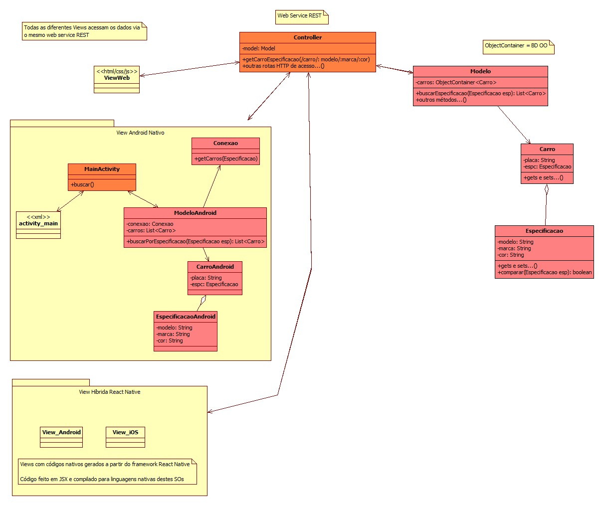
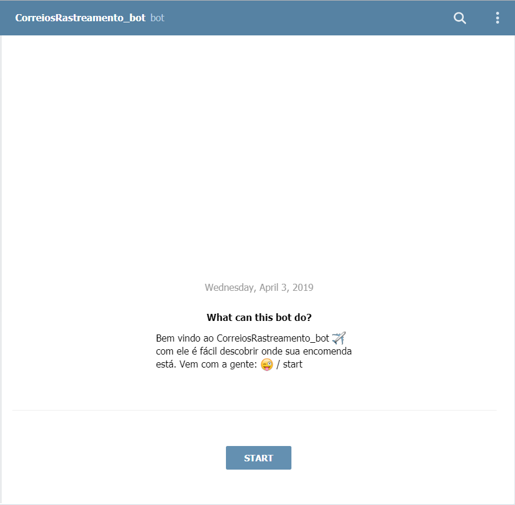

# Projeto Bot rastreio de mercadorias Telegram

**Daniel Willians de Souza** 
| 
**Thais Bitencourt de Meneses**

### Bot para rastreio de encomendas dos correios, com intuito de mostrar de forma facilitada as informações dos Correios, desta meneira apenas utilizando o Telegram podemos descobrir onde estão nossas encomendas.

## Fluxograma

## Protótipo

### Inicio

### Start

